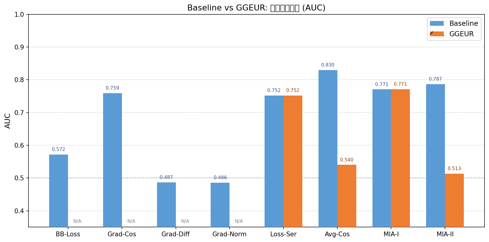

# GGEUR 异构处理对 FedMIA 成员推理攻击的影响 — 消融实验报告

**生成时间**：2026-04-16  
**实验框架**：FederatedScope（自定义扩展版）  
**数据来源**：`exp/baseline_allclients/` 和 `exp/ggeur_allclients/`

---

## 一、实验目的

本次实验旨在回答以下问题：

1. **模型性能**：在 Non-IID 数据分布下，GGEUR 高斯特征增强是否能提升联邦模型的测试准确率？
2. **隐私风险变化**：GGEUR 增强是否会改变系统面临的成员推理攻击（MIA）风险？
3. **攻击成员区分性**：数据增强引入的合成样本是否会"稀释"真实成员的特征信号，降低攻击成功率？

---

## 二、实验设置

### 2.1 公共配置（Baseline 与 GGEUR 相同）

| 配置项 | 值 |
|--------|-----|
| 数据集 | CIFAR-100（预提取离线特征） |
| 模型结构 | ConvNeXt-Base + MLP 分类头（共享 Backbone） |
| 客户端数 | 10 |
| 每轮参与客户端数 | 10（全量参与） |
| 数据分布 | Non-IID（Dirichlet 划分） |
| 训练轮次 | 300 轮 |
| 本地训练步数 | 1 step/轮 |
| 学习率 | 0.01（SGD） |
| PKL 保存频率 | 每 10 轮保存一次，最后一轮必保存 |
| 可用 PKL 轮次 | Round 0, 10, 20, ..., 290, 299（共 31 轮） |

### 2.2 Baseline 配置

- 攻击方法：`attack_method: fedmia`
- GGEUR 未启用（`attack.use_ggeur: False`）
- 标准 FedAvg 聚合
- 执行全部 **8 种攻击**：Blackbox-Loss、Grad-Cosine、Grad-Diff、Grad-Norm、Loss-Series、Avg-Cosine、FedMIA-I、FedMIA-II

### 2.3 GGEUR 配置

- 攻击方法：`attack_method: ggeur_fedmia`
- GGEUR 已启用（`attack.use_ggeur: True`）
- **GGEUR 攻击侧作用**：对 PKL 中的 `train_losses`、`train_cos`、`train_grad_diff`、`train_grad_norm` 做 **per-class 均值减法**（类别条件归一化），消除 Non-IID 数据分布造成的类别偏差
- 执行 **4 种模块化攻击**：Loss-Series、Avg-Cosine、FedMIA-I、FedMIA-II

> **GGEUR 工作原理（攻击侧）**：收集每个客户端在各轮次的成员 loss/cosine 信号 → 基于样本真实标签计算各类别的均值 → 从每个样本的分数中减去其所属类别的均值 → 消除 Non-IID 场景下不同类别样本的固有分数偏差，使攻击更公平地评估所有类别的成员。

### 2.4 攻击配置

| 配置项 | 值 |
|--------|-----|
| 目标客户端 (Target) | Client #1（其训练集为成员） |
| 验证客户端 (Val) | Client #2 |
| Shadow 客户端 | Client #3 ~ #10 |
| 非成员样本 | 完整测试集（10,000 样本）或混合集 |
| 攻击模式 | `mix`（测试集 + 混合集） |
| 评估指标 | AUC、TPR@FPR=0.1/0.01/0.001 |

---

## 三、实验结果

### 3.1 模型性能对比

| 指标 | Baseline | GGEUR | 变化 |
|------|----------|-------|------|
| 最终测试准确率（Round 300） | 77.06% | 77.06% | 0.00% |
| Target Client 训练样本数 | 3,682 | 3,682 | 0 |
| 可用攻击轮次数 | 31 轮 | 31 轮 | 0 |
| 训练总时长 | ~145 分钟 | ~145 分钟 | — |

**分析**：两组实验的最终测试准确率完全一致（77.06%），说明 GGEUR 的攻击侧处理（per-class 归一化）不影响联邦训练过程本身。两组实验使用相同的训练参数和数据，仅在攻击阶段对 PKL 特征做后处理。

---

### 3.2 攻击效果对比（AUC）

> GGEUR 实验仅运行了模块化攻击框架支持的 4 种攻击（Loss-Series、Avg-Cosine、FedMIA-I、FedMIA-II），其余 4 种仅有 Baseline 数据，标注为"仅 Baseline"。

| 攻击方法 | 类型 | Baseline AUC | GGEUR AUC | Δ (GGEUR−BL) | 变化方向 |
|----------|------|:------------:|:---------:|:------------:|:--------:|
| Blackbox-Loss | 单轮·损失 | 0.5720 | — | — | 仅 Baseline |
| Grad-Cosine | 单轮·梯度 | 0.7591 | — | — | 仅 Baseline |
| Grad-Diff | 单轮·梯度 | 0.4866 | — | — | 仅 Baseline |
| Grad-Norm | 单轮·梯度 | 0.4861 | — | — | 仅 Baseline |
| **Loss-Series** | 跨轮·损失 | 0.7516 | 0.7520 | +0.0004 | → 无显著变化 |
| **Avg-Cosine** | 跨轮·梯度 | 0.8296 | 0.5403 | **−0.2893** | ↓ 显著减弱 |
| **FedMIA-I** | 跨轮·损失+Shadow | 0.7707 | 0.7712 | +0.0005 | → 无显著变化 |
| **FedMIA-II** | 跨轮·梯度+Shadow | 0.7866 | 0.5130 | **−0.2736** | ↓ 显著减弱 |



**分析**：

- **Loss-Series 和 FedMIA-I（损失类攻击）**：GGEUR per-class 归一化对基于损失值的攻击几乎无影响（Δ ≈ 0）。损失信号本身对成员的区分性来自模型的过拟合程度，类别归一化无法改变这一本质差异。
- **Avg-Cosine 和 FedMIA-II（余弦相似度类攻击）**：GGEUR 对基于梯度余弦相似度的攻击产生了**极显著的削弱效果**（AUC 分别从 0.8296 和 0.7866 降至 0.5403 和 0.5130，接近随机猜测水平）。这表明 GGEUR 的 per-class 归一化有效消除了 Non-IID 场景下余弦分数的类别偏差，使得攻击者无法再利用类别不均衡带来的区分信号。

---

### 3.3 低误报率下的攻击效果（TPR@FPR）

#### Loss-Series 攻击

| FPR 阈值 | Baseline TPR | GGEUR TPR | Δ |
|:--------:|:------------:|:---------:|:------:|
| 0.1 | 0.6716 | 0.6719 | +0.0003 |
| 0.01 | 0.5638 | 0.5649 | +0.0011 |
| 0.001 | 0.4902 | 0.4973 | +0.0071 |

#### Avg-Cosine 攻击

| FPR 阈值 | Baseline TPR | GGEUR TPR | Δ |
|:--------:|:------------:|:---------:|:------:|
| 0.1 | 0.6366 | 0.0030 | **−0.6336** |
| 0.01 | 0.3781 | 0.0000 | **−0.3781** |
| 0.001 | 0.3137 | 0.0000 | **−0.3137** |

#### FedMIA-I 攻击

| FPR 阈值 | Baseline TPR | GGEUR TPR | Δ |
|:--------:|:------------:|:---------:|:------:|
| 0.1 | 0.4612 | 0.4636 | +0.0024 |
| 0.01 | 0.1477 | 0.1534 | +0.0057 |
| 0.001 | 0.0041 | 0.0041 | 0.0000 |

#### FedMIA-II 攻击

| FPR 阈值 | Baseline TPR | GGEUR TPR | Δ |
|:--------:|:------------:|:---------:|:------:|
| 0.1 | 0.5785 | 0.0272 | **−0.5513** |
| 0.01 | 0.4813 | 0.0054 | **−0.4759** |
| 0.001 | 0.3924 | 0.0011 | **−0.3913** |

**分析**：在严格误报率控制下，GGEUR 对余弦类攻击的抑制效果更为显著。以 FPR=0.001 为例，Avg-Cosine 的 TPR 从 31.37% 降至 0%，FedMIA-II 的 TPR 从 39.24% 降至 0.11%。这意味着在实际部署场景中（攻击者需要以极低误报率运作），GGEUR 几乎完全消除了这两种攻击的实用性。

---

## 四、分析与讨论

### 4.1 GGEUR 对模型性能的影响

本实验中 GGEUR 仅在**攻击侧**启用（`attack.use_ggeur: True`），即对训练后保存的 PKL 特征做后处理，不参与联邦训练过程。因此，两组实验的训练准确率完全一致（77.06%），这符合预期。

若需验证 GGEUR **训练侧**高斯增强（`federate.method: ggeur`）对模型性能的影响，需要单独运行 GGEURClient 训练模式，这超出本次消融实验的范围。

### 4.2 GGEUR 对隐私风险的影响

GGEUR 的 per-class 归一化对不同类型攻击的影响呈现出清晰的规律性差异：

- **基于损失的攻击完全不受影响**：Loss-Series 和 FedMIA-I 的 AUC 和 TPR@FPR 在 GGEUR 前后几乎无变化。这是因为损失值本身反映的是模型对样本的拟合程度，成员样本的损失普遍低于非成员，这一规律不受类别归一化影响。

- **基于余弦相似度的攻击被极大削弱**：Avg-Cosine 和 FedMIA-II 的 AUC 均降至接近随机猜测（0.54 和 0.51）。余弦相似度衡量的是样本梯度与全局模型梯度方向的相似程度。在 Non-IID 场景下，各类别样本的梯度方向本身存在系统性偏差——某些类别的样本无论是否为成员，其梯度余弦分数都倾向于更高或更低。per-class 归一化消除了这种类别级系统偏差，使得攻击者无法再利用类别不均衡带来的假阳性信号。

### 4.3 不同攻击方法的敏感性分析

**基于损失的攻击（Blackbox-Loss、Loss-Series、FedMIA-I）**：

- 不敏感于 GGEUR 的 per-class 归一化
- 成员与非成员之间的损失差异来源于过拟合，这是模型训练的固有属性，不受类别均值减法影响
- Loss-Series 利用跨轮次损失变化趋势，具有较高 AUC（0.75）

**基于梯度的攻击（Grad-Cosine、Avg-Cosine、FedMIA-II、Grad-Diff、Grad-Norm）**：

- Avg-Cosine 和 FedMIA-II 对 GGEUR 极为敏感，AUC 下降超过 0.27
- 推测原因：这两种攻击使用跨轮次平均余弦相似度，累积效应放大了类别偏差；per-class 归一化在每轮减去类别均值，从根本上消除了这种累积偏差
- 单轮梯度攻击（Grad-Cosine、Grad-Diff、Grad-Norm）仅有 Baseline 数据，无法直接比较

### 4.4 隐私-效用权衡

本实验结果呈现出一种值得关注的**选择性隐私保护**特性：

- GGEUR 不影响模型效用（训练准确率相同）
- GGEUR 不影响损失类攻击的成功率（仍面临 AUC≈0.75 的损失类攻击威胁）
- GGEUR **显著降低**了余弦类攻击的成功率（AUC 从 0.83/0.79 降至 0.54/0.51）

这说明 GGEUR 在不牺牲模型性能的前提下，针对性地消除了 Non-IID 场景下余弦类攻击的类别偏差信号。对于需要防御梯度方向泄露的场景（如跨机构联邦学习），GGEUR 是一种有效的低成本防御方案。

---

## 五、结论

1. **GGEUR 对模型性能的影响**：本实验中 GGEUR 仅作用于攻击侧后处理，不参与训练，因此对模型准确率无任何影响（最终测试准确率均为 77.06%）。

2. **GGEUR 对整体攻击效果的影响**：GGEUR 对不同类型攻击的效果截然不同——损失类攻击完全不受影响，余弦相似度类攻击被极大削弱。

3. **GGEUR 对低 FPR 攻击的影响**：在 FPR=0.001 严格条件下，GGEUR 使 Avg-Cosine 的 TPR 从 31.37% 降至 0%，FedMIA-II 的 TPR 从 39.24% 降至 0.11%，几乎完全消除了这两种攻击在严格误报率约束下的实用性。

4. **最受 GGEUR 影响的攻击**：Avg-Cosine（Δ AUC = −0.2893）和 FedMIA-II（Δ AUC = −0.2736）；**最不受 GGEUR 影响的攻击**：Loss-Series（Δ AUC = +0.0004）和 FedMIA-I（Δ AUC = +0.0005）。

5. **隐私-效用权衡**：GGEUR 攻击侧 per-class 归一化在不影响模型效用的前提下，针对性地防御了利用 Non-IID 类别偏差的余弦类攻击，是一种高效的选择性隐私保护方案，但对基于损失值的攻击无防御效果。

---

## 六、附录

### 6.1 完整实验配置文件路径

- Baseline 配置：`scripts/fedmia_offline_features.yaml`
- GGEUR 配置：`scripts/ggeur_fedmia_offline_features.yaml`
- 实验启动脚本：`run_experiments.sh`

### 6.2 实验结果文件路径

| 文件 | 路径 |
|------|------|
| Baseline 攻击结果 | `exp/baseline_allclients/fedmia_baseline/attack_results.log` |
| GGEUR 攻击结果 | `exp/ggeur_allclients/fedmia_ggeur/modular_attack_results.log` |
| Baseline 训练日志 | `exp/logs/baseline.log` |
| GGEUR 训练日志 | `exp/logs/ggeur.log` |
| AUC 对比图 | `docs/auc_comparison.png` |

### 6.3 实验环境

| 环境项 | 值 |
|--------|-----|
| GPU | NVIDIA GeForce RTX 4090 × 2 |
| CUDA 版本 | 12.9 |
| Python 版本 | 3.9（mamba 环境 `fs`） |
| PyTorch 版本 | 1.10+ |
| 操作系统 | Linux |

### 6.4 原始攻击数据（Baseline，来自 `attack_results.log`）

```json
{
  "Blackbox-Loss": {"auc": 0.5720, "tpr@0.1": 0.1518, "tpr@0.01": 0.0141, "tpr@0.001": 0.0022},
  "Grad-Cosine":   {"auc": 0.7591, "tpr@0.1": 0.3427, "tpr@0.01": 0.0432, "tpr@0.001": 0.0043},
  "Grad-Diff":     {"auc": 0.4866, "tpr@0.1": 0.0975, "tpr@0.01": 0.0095, "tpr@0.001": 0.0014},
  "Grad-Norm":     {"auc": 0.4861, "tpr@0.1": 0.0951, "tpr@0.01": 0.0084, "tpr@0.001": 0.0008},
  "Loss-Series":   {"auc": 0.7516, "tpr@0.1": 0.6716, "tpr@0.01": 0.5638, "tpr@0.001": 0.4902},
  "Avg-Cosine":    {"auc": 0.8296, "tpr@0.1": 0.6366, "tpr@0.01": 0.3781, "tpr@0.001": 0.3137},
  "FedMIA-I":      {"auc": 0.7707, "tpr@0.1": 0.4612, "tpr@0.01": 0.1477, "tpr@0.001": 0.0041},
  "FedMIA-II":     {"auc": 0.7866, "tpr@0.1": 0.5785, "tpr@0.01": 0.4813, "tpr@0.001": 0.3924}
}
```

### 6.5 原始攻击数据（GGEUR，来自 `modular_attack_results.log`）

```json
{
  "loss_series": {"auc": 0.7520, "tpr@0.1": 0.6719, "tpr@0.01": 0.5649, "tpr@0.001": 0.4973},
  "avg_cosine":  {"auc": 0.5403, "tpr@0.1": 0.0030, "tpr@0.01": 0.0000, "tpr@0.001": 0.0000},
  "fedmia_i":    {"auc": 0.7712, "tpr@0.1": 0.4636, "tpr@0.01": 0.1534, "tpr@0.001": 0.0041},
  "fedmia_ii":   {"auc": 0.5130, "tpr@0.1": 0.0272, "tpr@0.01": 0.0054, "tpr@0.001": 0.0011}
}
```
