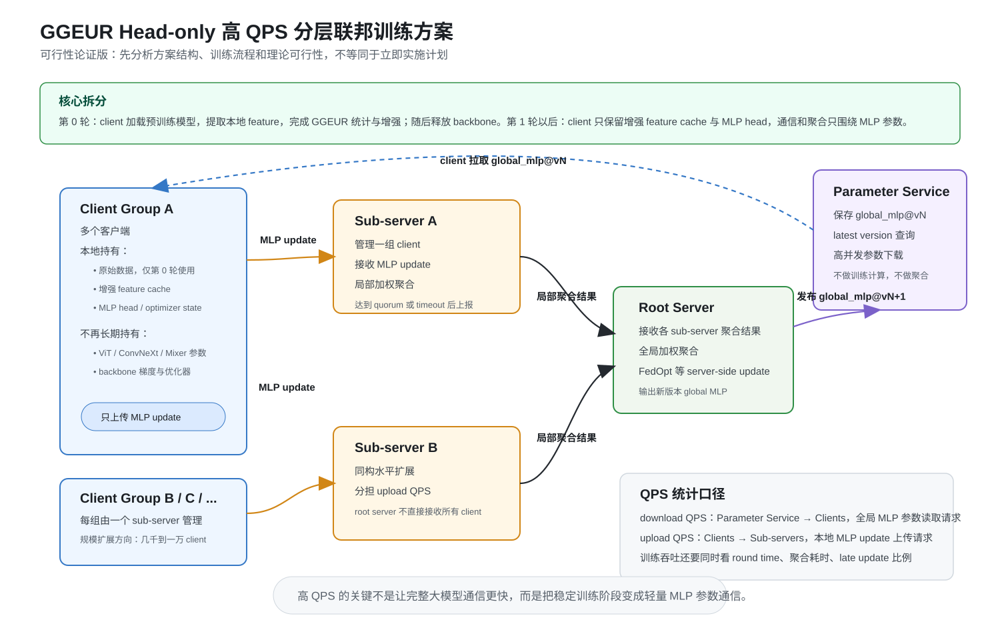
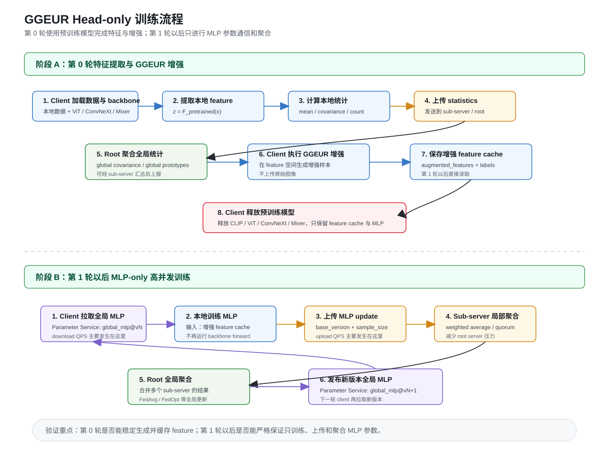

# GGEUR Head-only 高 QPS 分层联邦训练方案（可行性论证版）

## 1. 本文档要回答的问题

本文档不是立即实施计划，而是用于论证一个系统方案是否具有可行性。

需要回答的问题是：

```text
在 GGEUR 当前实现基础上，是否可以把训练流程拆成：

第 0 轮：客户端短暂加载预训练模型，完成特征提取、统计上传和 GGEUR 增强；
第 1 轮以后：客户端释放预训练模型，只保留增强后的 feature 与 MLP 分类头；
随后通过多级服务器和参数管理模块支撑大规模 client 通信，并以此冲击 10000+ QPS。
```

本文档围绕四个方面展开：

1. 方案结构是什么。
2. 训练流程如何运行。
3. 当前代码是否支持这个思路。
4. 该方案的可行性、风险和验证路径是什么。

## 2. 一句话概括方案

该方案的核心是：

```text
把 GGEUR 的大模型能力前置到第 0 轮，把后续联邦训练压缩成轻量 MLP 参数通信。
```

更具体地说：

1. 客户端第 0 轮加载 ViT-B/16、ConvNeXt、Mixer 或 CLIP image encoder。
2. 客户端使用预训练模型提取本地图像 feature。
3. 客户端上传每类 feature 的统计量，而不是上传原始图像。
4. 服务器聚合 global covariance 和 prototype。
5. 客户端在 feature 空间执行 GGEUR augmentation。
6. 客户端把增强后的 feature 和 label 缓存下来。
7. 客户端释放预训练模型，只保留 MLP 分类头。
8. 后续每轮只拉取、训练、上传 MLP 参数。
9. 子服务器负责汇总大量客户端的 MLP update。
10. 总服务器只聚合子服务器结果。
11. 参数管理模块负责高并发分发最新全局 MLP 参数。

这个方案本质上是：

```text
Head-only Federated Training over Cached GGEUR Features
```

## 3. 为什么这个方案值得论证

如果完整传输 ViT、ConvNeXt 或 Mixer 参数，10000+ QPS 几乎不现实。原因是：

- 参数体积大。
- 序列化和反序列化成本高。
- 聚合计算重。
- 网络带宽压力大。
- root server 很容易成为瓶颈。

但如果后续训练只通信 MLP head：

- 单次上传/下载 payload 会小很多。
- 子服务器可以先做局部聚合。
- 参数管理模块可以缓存和高并发分发 MLP 参数。
- root server 不再直接处理所有 client update。
- 10000+ QPS 变成可以被系统架构设计和压测验证的问题。

因此，该方案的价值不是提高单个模型的表达能力，而是把训练系统改造成更适合大规模并发通信的形态。

## 4. 架构示意图

### 4.1 总体架构



图中有四类角色。

### 4.2 Client

client 是真实训练主体。

第 0 轮持有：

- 本地原始数据。
- 预训练 backbone。
- 本地 feature。
- local mean / covariance / count。

第 0 轮后持有：

- 增强后的 feature cache。
- label。
- MLP 分类头。
- MLP optimizer state。

第 0 轮后不再长期持有：

- ViT-B/16 参数。
- ConvNeXt 参数。
- Mixer 参数。
- CLIP image encoder 参数。
- backbone optimizer state。

### 4.3 Sub-server

sub-server 管理一组 client。

它负责：

- 接收 client 上传的 MLP update。
- 校验 update 版本。
- 按样本数做局部加权聚合。
- 达到 quorum 或 timeout 后上传局部聚合结果。
- 记录慢 client、掉线 client 和 late update。

它不负责：

- 下发全局模型。
- 保存最终全局模型。
- 读取 client 原始数据。

### 4.4 Root Server

root server 是全局聚合节点。

它负责：

- 接收多个 sub-server 的局部聚合结果。
- 按 `total_sample_size` 做全局加权聚合。
- 执行 FedAvg 或 FedOpt 等全局更新。
- 生成新的 global MLP 参数版本。
- 将新版本发布给 parameter service。

root server 不直接接收一万个 client 的 update。

### 4.5 Parameter Service

parameter service 是全局参数管理模块。

它负责：

- 保存 `global_mlp@vN`。
- 提供 latest version 查询。
- 提供指定版本参数下载。
- 保存 metadata、checksum、shape 和 feature cache version。
- 支撑高并发参数读取。

它不负责：

- 训练。
- 聚合。
- 特征提取。
- 数据增强。

## 5. 训练流程示意图



## 6. 训练流程细节

### 6.1 实验初始化

实验开始时，系统需要确定：

- 实验 ID。
- 数据集。
- feature extractor 类型。
- backbone 名称。
- embedding 维度。
- 类别数。
- MLP head 结构。
- client 总数。
- 每轮采样 client 数。
- sub-server 数量。

参数管理模块创建初始版本：

```text
global_mlp@v0
```

该版本只包含 MLP 分类头参数，不包含 ViT、ConvNeXt、Mixer 或 CLIP image encoder。

### 6.2 第 0 轮：预训练模型只用于特征和增强

第 0 轮是整个方案的关键。

client 执行：

1. 加载自己的本地数据。
2. 加载预训练 backbone。
3. 对本地图像执行前向传播，得到 feature：

```text
z = F_pretrained(x)
```

4. 按类别统计：

```text
mean_c
covariance_c
count_c
prototype_c
```

5. 上传 local statistics。

server 侧执行：

1. 收集各 client 的 local statistics。
2. 聚合 global covariance。
3. 聚合 global prototype。
4. 为每个 client 准备 cross-client prototypes。
5. 下发 global covariance 和 prototypes。

client 再执行：

1. 接收 global covariance 和 prototypes。
2. 在 feature 空间执行 Gaussian augmentation。
3. 生成增强 feature。
4. 构建训练数据：

```text
augmented_features
augmented_labels
```

5. 将增强 feature 缓存到本地。
6. 释放预训练 backbone。
7. 进入 MLP-only 训练阶段。

第 0 轮结束后，client 的训练输入不再是图像，而是：

```text
(feature, label)
```

### 6.3 第 1 轮以后：只训练 MLP

每一轮稳定训练流程如下。

client 执行：

1. 向 parameter service 查询 latest version。
2. 拉取 `global_mlp@vN`。
3. 校验参数是否匹配本地 feature cache：

```text
embedding_dim
num_classes
head architecture
feature_cache_version
checksum
```

4. 加载本地增强 feature cache。
5. 用 feature 训练 MLP：

```text
y_hat = MLP_w(z)
loss = CE(y_hat, y)
```

6. 上传本地 MLP update 到 sub-server。

client 上传内容应包含：

```json
{
  "client_id": "client_000001",
  "sub_server_id": "sub_01",
  "round": 12,
  "base_version": 11,
  "sample_size": 128,
  "feature_cache_version": "fcache_v1",
  "mlp_state_dict": "...",
  "metrics": {
    "train_loss": 0.73,
    "train_acc": 0.81
  }
}
```

sub-server 执行：

1. 接收 client update。
2. 检查 `base_version` 是否匹配当前 round。
3. 丢弃版本过旧或格式错误的 update。
4. 按 `sample_size` 加权聚合本组 client 的 MLP 参数。
5. 达到 quorum 或 timeout 后上传给 root server。

sub-server 上传内容应包含：

```json
{
  "sub_server_id": "sub_01",
  "round": 12,
  "base_version": 11,
  "client_count": 800,
  "total_sample_size": 102400,
  "aggregated_mlp_state_dict": "...",
  "dropped_clients": ["client_000123"],
  "late_clients": ["client_000456"]
}
```

root server 执行：

1. 接收各 sub-server 的局部聚合结果。
2. 按 `total_sample_size` 二次加权聚合。
3. 如果使用 FedOpt，在 root server 执行 server-side update。
4. 生成 `global_mlp@vN+1`。
5. 发布到 parameter service。

parameter service 执行：

1. 保存新版本 MLP。
2. 更新 latest pointer。
3. 保存 checksum 和 metadata。
4. 等待下一轮 client 高并发拉取。

## 7. QPS 指标如何理解

本方案中的 `10000+ QPS` 不能只写成一个数字，需要拆成两个指标。

### 7.1 Download QPS

download QPS 指 client 从 parameter service 读取全局 MLP 参数。

例如：

```text
10000 个 client 在 1 秒内完成 latest 查询和 MLP 参数读取
= 10000 download QPS
```

download QPS 相对容易扩展，因为：

- 参数是只读的。
- latest pointer 可缓存。
- MLP 参数体积小。
- parameter service 可以横向扩展。

### 7.2 Upload QPS

upload QPS 指 client 向 sub-server 上传本地 MLP update。

例如：

```text
10000 个 client 在 1 秒内上传 MLP update
= 10000 upload QPS
```

upload QPS 更难，因为它涉及：

- 参数接收。
- 参数反序列化。
- 版本校验。
- 样本量统计。
- 队列处理。
- 局部聚合。

因此，高 QPS 方案必须使用 sub-server 分片，而不能让所有 client 直接打到 root server。

### 7.3 训练吞吐不能只看 QPS

还需要同时记录：

- 每轮耗时。
- 每轮有效 client 数。
- late update 比例。
- dropped client 数。
- sub-server 聚合耗时。
- root server 聚合耗时。
- 参数发布耗时。
- 单次 upload/download payload 大小。

## 8. 为什么需要 sampling + quorum

如果 client 数量达到几千到一万，不能每轮同步等待所有 client。

原因：

- 总会有慢 client。
- 总会有掉线 client。
- 不同 client 数据量和设备性能不同。
- 某些 client 可能 OOM 或网络抖动。

因此稳定训练阶段需要：

```text
采样部分 client + 达到 quorum 后聚合
```

示例：

```yaml
client_total: 10000
sample_clients_per_round: 500
min_received_ratio: 0.8
round_timeout: 60
late_update_policy: discard
```

含义：

- 每轮采样 500 个 client。
- 收到 400 个有效 update 后即可聚合。
- 超时后还没返回的 update 记为 late。
- 第一阶段 late update 直接丢弃。

这不是完全异步 FL，但比同步等待所有 client 更适合高并发真实系统。

## 9. 当前代码验证结果

以下内容是已经根据当前仓库代码检查得到的结论，不是推测。

### 9.1 已确认：配置层支持冻结、缓存和卸载 extractor

当前配置中已有：

```yaml
ggeur:
  freeze_backbone: true
  use_feature_cache: true
  unload_extractor_after_cache: true
```

含义：

- CNN/timm extractor 默认冻结。
- client 支持 feature cache。
- client 支持特征提取后卸载 extractor。

### 9.2 已确认：client round 0 会提取本地 feature

当前 `GGEURClient._extract_features()` 支持：

- `clip`
- `cnn`
- `timm`

提取后的 feature 按 class 写入：

```text
self.local_features
self.local_labels
```

### 9.3 已确认：client 上传的是 statistics，不是原始图像

当前 client 会计算并上传：

```text
local means
local covariances
local counts
local prototypes
```

不会上传原始图像。

### 9.4 已确认：server 聚合 covariance 和 prototype

当前 server 会：

- 收集各 client 的 local statistics。
- 校验 embedding dim 和 covariance shape。
- 聚合 global covariance。
- 聚合 global prototypes。
- 为每个 client 准备 cross-client prototypes。
- 下发 global covariance/prototypes。

### 9.5 已确认：augmentation 在 feature 空间完成

当前 client 收到 global covariance 后执行 `_perform_augmentation()`。

该函数生成的是：

```text
self.augmented_features
self.augmented_labels
```

并构建：

```text
AugmentedFeatureDataset
```

训练数据是 feature，不是图像。

### 9.6 已确认：标准训练阶段只训练 MLP

当前 `_train_on_augmented_data()` 中的训练形式是：

```text
outputs = self.mlp_classifier(features)
loss = criterion(outputs, labels)
```

训练完成后返回：

```text
copy.deepcopy(self.mlp_classifier.state_dict())
```

也就是说，标准路径上传的是 MLP 参数。

### 9.7 已确认：server 标准模式只下发和聚合 MLP

当前 server 标准模式下：

- `_build_global_mlp()` 构建全局 MLP。
- `_start_training_round()` 下发 `global_mlp.state_dict()`。
- `_perform_fedavg()` 聚合 client 返回的 MLP 参数。
- FedOpt 也作用在 `global_mlp` 上。

### 9.8 已确认：以下路径不属于严格 head-only

以下配置打开后，会破坏本方案第一阶段假设：

```text
use_cnn_distillation
use_feature_alignment
use_separated_training
use_end_to_end_finetune
use_promptfl
```

原因：

- CNN distillation / feature alignment 会重新构建或训练 CNN。
- separated training 会进入 CNN backbone 训练阶段。
- end-to-end fine-tuning 会更新 backbone。
- PromptFL 训练的是 prompt，并仍依赖 CLIP text encoder，不是 MLP-only。

## 10. 可行性分析

### 10.1 算法层面可行

如果 backbone 冻结，则训练目标可以写成：

```text
z = F_pretrained(x)
min_w loss(MLP_w(z), y)
```

当 `z` 已经缓存后，优化只发生在 `w` 上，也就是 MLP 参数上。

因此，client 在第 0 轮后释放 backbone，在理论上成立。

### 10.2 当前实现层面基本可行

当前标准 GGEUR 路径已经实际具备：

- feature extraction
- local statistics
- feature-space augmentation
- MLP training
- MLP state dict upload
- MLP aggregation

因此不需要重写 GGEUR 算法才能讨论该方案。

需要补的是系统化能力：

- 增强 feature 落盘。
- head-only 强约束。
- 参数服务。
- 分层聚合。
- quorum。
- QPS 压测。

### 10.3 系统层面有可行路径

系统扩展的关键是把压力拆开：

```text
download 压力 -> parameter service
upload 压力 -> 多个 sub-server
global aggregation 压力 -> root server 只处理 sub-server 结果
```

这样 root server 不需要承接所有 client 请求。

### 10.4 10000 QPS 可达性估计

`10000+ QPS` 有机会实现，但前提是必须限定为轻量 MLP 参数的读取和上传，而不是完整模型参数通信。

可达性可以分三层判断。

第一层：参数下载侧较有机会达到。

```text
Parameter Service -> Clients
```

原因：

- 全局 MLP 参数是只读对象。
- latest version 可以缓存。
- MLP 参数远小于 ViT/ConvNeXt/Mixer backbone。
- 参数服务可以横向扩展。
- 甚至可以把参数对象放入内存缓存、对象存储或边缘缓存。

因此，`10000 download QPS` 是本方案中最容易先验证的目标。

第二层：参数上传侧难度中高，但有工程可行性。

```text
Clients -> Sub-servers
```

上传侧不能只靠缓存，因为每个 client update 都需要被接收、校验、计数和聚合。若采用多个 sub-server 分片，例如：

```text
10000 clients / 10 sub-servers = 每个 sub-server 约 1000 clients
```

那么每个 sub-server 的瞬时压力会大幅下降。只要 MLP 参数足够小，并且采用批处理、异步队列和局部聚合，`整体 10000 upload QPS` 有机会通过水平扩展实现。

第三层：端到端训练吞吐难度最高。

即使 download/upload QPS 达标，也不代表训练系统达标。端到端还受以下因素影响：

- client 本地训练耗时。
- sub-server 聚合耗时。
- root server 全局聚合耗时。
- parameter service 发布新版本耗时。
- late update 比例。
- 每轮采样 client 数。

因此，本方案对 `10000 QPS` 的判断是：

```text
参数下载 10000 QPS：可行性较高。
参数上传 10000 QPS：可行性中等偏高，需要 sub-server 分片和批处理。
端到端每轮 10000 client 全量同步训练：不现实。
端到端采样 + quorum 的大规模训练：有机会实现。
```

### 10.5 通信难度评估

通信难度主要取决于单次请求 payload 大小、请求并发方式和聚合策略。

#### 情况 1：通信完整 backbone

如果通信 ViT、ConvNeXt、Mixer 等完整模型参数，难度极高。

原因：

- 单次 payload 可能达到数十 MB 到数百 MB。
- 一万个 client 会产生不可接受的网络吞吐。
- 序列化、反序列化和聚合都会成为瓶颈。

该路径不适合作为 10000 QPS 目标。

#### 情况 2：只通信 MLP head

如果只通信 MLP head，难度显著下降。

以线性 head 为例：

```text
参数量约等于 embedding_dim * num_classes + bias
```

对于 `embedding_dim=512`、`num_classes=65`：

```text
512 * 65 + 65 = 33345 个参数
float32 约 130 KB
float16 约 65 KB
```

如果使用一层较小 hidden MLP，参数会增加，但通常仍远小于完整 backbone。

这意味着：

- 10000 次下载约为数百 MB 到 1GB 级别，仍需优化，但不再是完全不可行。
- 10000 次上传如果分散到多个 sub-server，可以通过水平扩展承接。
- 如果进一步使用 float16、delta update、压缩或量化，通信压力还能继续下降。

#### 情况 3：只传 delta 或压缩参数

进一步优化后，client 不一定上传完整 MLP state dict，而可以上传：

```text
delta = local_mlp - global_mlp
```

并结合：

- float16
- top-k sparsification
- int8 quantization
- zstd/zlib 压缩
- 小批量聚合

这会进一步降低上传带宽，但也会引入精度损失和额外实现复杂度。

### 10.6 为实现 10000 QPS 需要做的优化层级

#### 第一级：必须做的结构性优化

这些是方案成立的基础：

- 只通信 MLP head。
- 第 0 轮后释放 backbone。
- 增强 feature 落盘。
- 参数服务独立化。
- sub-server 分片接收 client update。
- root server 只聚合 sub-server 结果。
- sampling + quorum，避免全量同步等待。

#### 第二级：必须做的通信优化

这些决定能否接近 10000 QPS：

- MLP 参数使用 float16 或紧凑序列化。
- update 请求包含版本号和 checksum，便于快速拒绝非法请求。
- sub-server 使用异步队列接收 update。
- sub-server 批量聚合，不逐请求阻塞聚合。
- parameter service 对 latest 和 global_mlp 做内存缓存。
- 参数对象按 version immutable 存储，便于高并发读取。

#### 第三级：建议做的吞吐优化

这些用于进一步提高上限：

- MLP delta update，而不是完整 state dict。
- 参数量化，例如 int8 或低比特量化。
- 稀疏上传，例如 top-k delta。
- sub-server 内部多线程/多进程聚合。
- root server 聚合使用向量化批处理。
- 对 client 分批调度，避免所有 client 在同一毫秒打满服务。
- 增加 backpressure，避免队列无限堆积。

#### 第四级：实验与监控优化

这些用于判断是否真正达标：

- 分开统计 download QPS 和 upload QPS。
- 统计 P50/P95/P99 延迟。
- 统计 payload size。
- 统计 sub-server queue backlog。
- 统计 late update ratio。
- 统计每轮有效 client 数。
- 统计每轮 wall-clock time。

### 10.7 创新性改进建议

本方案可以进一步加入以下创新点，使其不只是“分层 FedAvg”，而是更贴合 GGEUR 特征增强和高 QPS 目标。

#### 改进 1：Feature Version 与 Model Version 解耦

将特征版本和模型版本拆开：

```text
feature_cache_version: 描述第 0 轮特征和增强结果
global_mlp_version: 描述每轮全局 MLP 参数
```

好处：

- client 可以长期复用稳定 feature cache。
- MLP 参数可以快速迭代。
- server 可以拒绝 feature version 不兼容的 update。

#### 改进 2：分层 GGEUR statistics 聚合

第 0 轮 statistics 也可以分层处理：

```text
client local statistics -> sub-server partial statistics -> root global statistics
```

对于 covariance 和 prototype，可以让 sub-server 先做局部合并，root server 再二次聚合。

好处：

- 降低 root server 第 0 轮压力。
- 更适合一万 client 场景。
- 与后续 MLP 分层聚合保持一致。

#### 改进 3：参数服务采用不可变版本对象

每一轮全局 MLP 都保存为不可变对象：

```text
global_mlp/v0001
global_mlp/v0002
global_mlp/v0003
```

latest 只是一个指针。

好处：

- client 可以按版本拉取。
- late update 可以准确判断 base_version。
- 回滚和复现实验更容易。
- 参数下载可被缓存。

#### 改进 4：Client Pull 而不是 Server Push

稳定训练阶段不由 server 主动向所有 client 推送模型，而是 client 自己从 parameter service 拉取。

好处：

- 避免 server 对大量 client 的扇出压力。
- client 可以错峰拉取。
- parameter service 更容易横向扩展。

#### 改进 5：子服务器只上传聚合结果和统计摘要

sub-server 不把所有 client update 转发给 root，而只上传：

```text
aggregated_mlp
total_sample_size
client_count
late_count
dropped_count
metric_summary
```

好处：

- root server 通信量从 O(client_num) 降到 O(sub_server_num)。
- root server 聚合压力稳定。

#### 改进 6：基于 client 速度的自适应采样

维护 client 的历史训练耗时和掉线率，采样时给稳定 client 更高概率。

好处：

- 降低 late update。
- 提升每轮有效 client 数。
- 缩短 round time。

但需要注意：

- 不能过度偏向快 client，否则可能引入数据偏差。
- 需要保留一定随机性，保证数据覆盖。

#### 改进 7：MLP delta 压缩上传

client 上传：

```text
delta = local_mlp - global_mlp
```

而不是完整 local MLP。

可以进一步结合：

- float16
- int8
- top-k sparsification
- error feedback

好处：

- 降低 upload payload。
- 更适合高 QPS。

代价：

- 实现复杂度提高。
- 需要验证压缩对精度的影响。

### 10.8 总体可行性判断

综合来看，该方案有机会支撑 `10000+ QPS`，但不能理解为“一万个 client 每秒都完成完整训练轮次”。

更合理的目标表述是：

```text
在 Head-only 模式下，系统支持 10000+ 级别的参数读取/上传请求吞吐；
训练侧采用 sampling + quorum，在大规模 client 池中完成稳定多轮联邦训练。
```

达成该目标的难度评估：

| 目标 | 难度 | 可行性判断 |
| --- | --- | --- |
| 10000 download QPS | 中等 | 有较大机会，通过参数缓存和横向扩展实现 |
| 10000 upload QPS | 中高 | 有机会，需要 sub-server 分片、异步队列和批聚合 |
| 单轮等待 10000 client 全部返回 | 极高 | 不建议作为目标 |
| 10000 client 池中采样训练 | 中高 | 可作为主要训练模式 |
| 完整 backbone 参数 10000 QPS | 极高 | 基本不现实 |

因此，该方案的核心判断是：

```text
如果坚持完整模型通信，10000 QPS 基本不可行；
如果严格切换到 MLP-only + 分层聚合 + 参数服务，10000 QPS 有实现机会，但需要较多系统优化和压测验证。
```

### 10.9 主要风险

#### 风险 1：增强 feature 没有稳定落盘

当前增强 feature 主要在内存中。

如果 client 重启，当前流程不能直接从增强 feature cache 恢复。

这个风险可以通过新增 augmented feature cache 解决。

#### 风险 2：QPS 达标不等于训练吞吐达标

可能出现：

```text
parameter service 下载 QPS 达标
但 upload 聚合和 round time 不达标
```

因此压测必须拆分 download、upload 和端到端训练吞吐。

#### 风险 3：部分方法不适合 head-only

PromptFL、CNN distillation、feature alignment 等不能直接纳入第一阶段。

需要在方案中明确第一阶段只讨论标准 MLP head 路径。

#### 风险 4：版本管理不严会污染模型

client 可能基于旧版本训练后才上传。

必须要求 update 带：

```text
base_version
round
feature_cache_version
```

第一阶段只接受当前版本 update。

#### 风险 5：一万 client 不能同步等待全部返回

必须采用 sampling + quorum。

否则少数慢 client 会拖住整个 round。

## 11. 需要补充实现的能力

虽然当前代码支持该方案的核心训练逻辑，但完整系统还需要补充以下能力。

### 11.1 增强 feature cache

需要把第 0 轮生成的增强 feature 保存到本地。

缓存内容：

```text
augmented_features
augmented_labels
client_id
dataset
feature_extractor
embedding_dim
augmentation_config_hash
global_statistics_version
class_mapping
```

### 11.2 head-only 模式开关

需要新增：

```yaml
ggeur:
  head_only_mode: true
```

当它开启时，系统必须拒绝以下配置：

```text
use_cnn_distillation = true
use_feature_alignment = true
use_separated_training = true
use_end_to_end_finetune = true
use_promptfl = true
```

### 11.3 参数管理模块

需要支持：

```text
GET latest
GET global_mlp@version
PUT global_mlp@version
```

每个版本需要保存 metadata：

```json
{
  "version": 12,
  "round": 12,
  "param_type": "mlp_head",
  "embedding_dim": 512,
  "num_classes": 65,
  "checksum": "...",
  "feature_cache_version": "fcache_v1"
}
```

### 11.4 sub-server 局部聚合

需要实现：

- client update 接收。
- update 版本校验。
- update 队列。
- quorum 判断。
- 按 sample size 加权聚合。
- 上传 root server。

### 11.5 root server 分层聚合

需要实现：

- 接收 sub-server 聚合结果。
- 二次加权聚合。
- FedOpt root-side update。
- 发布新版本到 parameter service。

## 12. 可行性验证设计

### 12.1 已完成的代码级验证

已经完成代码级检查，结论是：

```text
当前标准 GGEUR + MLP 路径已经具备 head-only 方案的核心基础。
```

检查覆盖：

- 配置项。
- feature extraction。
- local statistics。
- global covariance/prototype。
- feature-space augmentation。
- MLP training。
- MLP state dict upload。
- server MLP aggregation。
- 不兼容路径识别。

### 12.2 下一步概念验证：第 0 轮后无 backbone 训练

目标：

```text
证明 round 1+ 不需要预训练模型。
```

验证方式：

1. 跑 `OfficeHome + GGEUR + FedAvg + CLIP ViT-B-16`。
2. 第 0 轮完成后确认 extractor unload。
3. round 1+ 检查是否只进入 `_train_on_augmented_data()`。
4. 检查上传参数是否只有 MLP state dict。
5. 检查 server 是否只聚合 MLP。

通过标准：

- round 1+ 不再调用图像 feature extraction。
- client 可释放 backbone 显存。
- MLP 聚合正常完成。

### 12.3 下一步概念验证：增强 feature 落盘恢复

目标：

```text
证明第 0 轮后即使 client 重启，也能只用增强 feature cache 继续训练。
```

验证方式：

1. 保存 augmented feature cache。
2. 重启 client。
3. 不加载 CLIP/ConvNeXt/Mixer。
4. 直接读取 augmented feature cache。
5. 执行 MLP 训练并上传参数。

通过标准：

- 不加载 backbone 也能完成 round 1+。
- 训练结果与内存流程一致或接近。

### 12.4 QPS 可行性验证

分三步验证。

第一步：参数下载压测。

```text
固定 global_mlp@vN
模拟 10000 client 并发读取
记录 download QPS 和 P95/P99 latency
```

第二步：update 上传压测。

```text
固定 MLP 参数 shape
模拟 10000 client 上传 update
记录 sub-server upload QPS、队列长度和聚合耗时
```

第三步：端到端分层训练压测。

```text
parameter service + root server + 多个 sub-server + simulated clients
验证多轮 version 发布、client 拉取、局部聚合和全局聚合
```

## 13. 方案评审关注点

方案评审时建议重点关注以下问题。

1. 是否认可把 QPS 定义为训练阶段参数读取和上传请求数。
2. 是否认可第 0 轮后只训练 MLP 的任务设定。
3. 是否接受第一阶段只覆盖 MLP head，不覆盖 PromptFL/CNN 等路径。
4. 10000+ QPS 更应优先验证 download 侧，还是 upload 侧。
5. sub-server 数量如何估算。
6. 每轮采样 client 数和 quorum 比例如何设定。
7. 该方案是否仍满足真实联邦学习的数据隔离要求。
8. 最小可行验证应使用真实 client 还是 simulated client。

## 14. 当前结论

该方案具备理论可行性和工程验证价值。

原因是：

```text
GGEUR 标准路径天然包含 feature extraction -> feature augmentation -> MLP training 的阶段拆分；
当前代码已经确认标准训练阶段训练和上传的是 MLP；
因此可以把大模型从稳定训练阶段移除，只保留轻量 MLP 参数通信。
```

但它还不是当前已经完成的系统能力。

还需要补齐：

```text
增强 feature 落盘
head-only 强约束
参数管理模块
sub-server 局部聚合
root server 分层聚合
sampling + quorum
QPS 压测
```

因此，可以将该方案定位为：

```text
基于当前 GGEUR 实现的高并发联邦训练架构设想，核心算法路径已有代码基础，系统扩展部分仍需验证。
```
