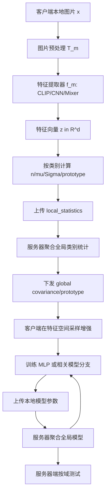
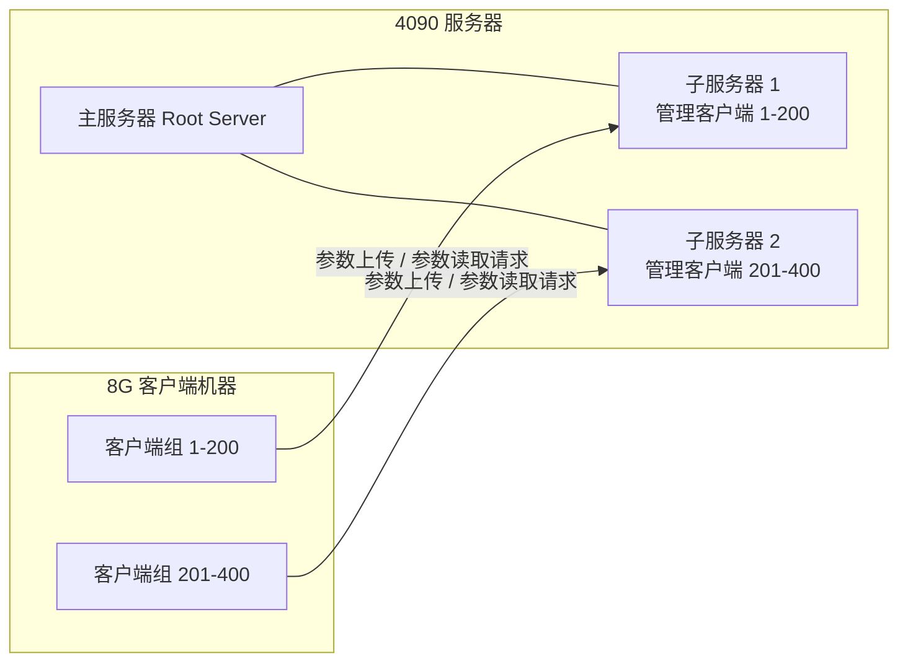
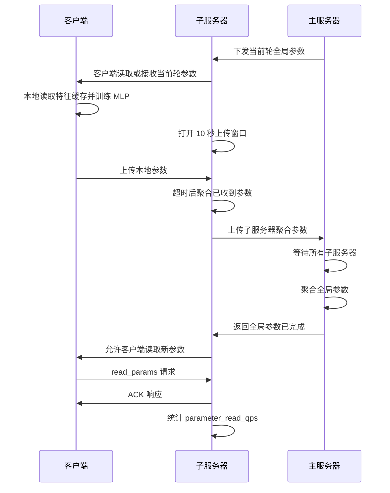

# GGEUR 跨域异构联邦学习与分层分布式实现技术方案

版本日期：2026-07-01

本文整理当前项目的算法方案、对比方法、数据与模型处理方式，以及分层分布式落地实现。重点说明四个问题：

1. 当前已经实现了哪些对比方法。
2. 主方法 GGEUR 相比对比方法解决了什么问题，有哪些提升点。
3. GGEUR 的具体实现流程，包括图片处理、特征生成、统计量聚合、特征增强、训练和测试。
4. 当前分布式实现如何支撑多客户端、多子服务器的参数上传、聚合、读取和 QPS 统计。

---

## 1. 技术背景与目标

本项目面向跨域视觉联邦学习。系统中有多个客户端，每个客户端持有本地图片数据，数据可能来自不同视觉域。例如 OfficeHome 中的 Art、Clipart、Product、Real_World，DomainNet 中的 clipart、painting、real、sketch。相同类别在不同域中的纹理、颜色、背景和边缘形态差异明显，这会导致客户端之间的数据分布不一致。

项目要处理的核心问题包括：

| 问题 | 具体表现 |
| --- | --- |
| 跨域差异 | 同一类别在不同域中视觉风格不同，模型容易偏向本地域 |
| 非 IID | 客户端类别分布、样本数量、域分布不均衡 |
| 客户端样本少 | 单个客户端难以估计稳定的类别分布 |
| 模型路线异构 | 系统需要支持 ViT/CLIP、CNN、Mixer 等不同特征提取方式 |
| 原始数据不可共享 | 联邦学习场景下客户端不能上传原始图片 |
| 大量客户端落地 | 后续需要支持数百客户端下的训练和参数服务验证 |

GGEUR 的核心目标是：在不上传原始图片的前提下，通过特征空间中的全局统计信息补足本地客户端缺失的类别和域信息，从而缓解跨域和非 IID 导致的训练不稳定与泛化不足。

---

## 2. 已实现的对比方法

当前代码已经覆盖 6 类联邦学习对比方法，并可以在多数据集、多模型路线下生成配置。

| 方法 | 当前实现定位 | 解决的问题 | 与 GGEUR 的关系 |
| --- | --- | --- | --- |
| FedAvg | 基础对比方法 | 按客户端样本数加权平均模型参数 | GGEUR 后续训练阶段默认仍可使用 FedAvg 聚合 |
| FedProx | 客户端漂移对比方法 | 在本地训练加入近端项，限制本地模型偏离全局模型 | 主要约束优化过程，不主动补足数据分布 |
| FedOpt | 服务器优化对比方法 | 服务器端使用优化器更新全局模型 | 改进服务器聚合方式，不改变客户端数据表示 |
| MOON | 表征一致性对比方法 | 通过模型对比损失稳定本地训练 | 主要缓解本地训练漂移，不生成新样本 |
| FedProto | 原型联邦对比方法 | 聚合类别原型，约束类别表示 | 和 GGEUR 最接近，但只使用均值/原型，不显式建模类内协方差 |
| PromptFL | CLIP prompt 对比方法 | 训练 CLIP 文本侧软提示并聚合 prompt 参数 | 适用于 CLIP prompt 场景，不属于纯 MLP HeadOnly 路线 |

这些方法主要作为对比基线。它们分别从参数聚合、客户端优化、表征约束、prompt 学习等角度提升联邦训练，但普遍没有直接解决“客户端本地数据不足、域信息缺失、类别分布不全”的数据层问题。

GGEUR 的区别在于：它在训练前增加了一个类别级全局统计与特征生成阶段，用全局类别协方差和原型在客户端本地生成增强特征。也就是说，GGEUR 不只是改聚合公式，而是在联邦训练的数据表示层做补强。

---

## 3. 主方法 GGEUR 的核心提升点

GGEUR 可以理解为一种“特征空间的数据增强 + 联邦训练”方法。它的提升点主要有四个。

### 3.1 从参数聚合扩展到数据表示补强

FedAvg、FedProx、FedOpt、MOON 等方法主要处理训练和聚合过程：

```text
客户端本地训练 -> 上传模型参数 -> 服务器聚合参数
```

如果客户端本地缺少某些类别、某些域，或者每类样本很少，这些方法本身不会主动补足数据。GGEUR 在训练前增加统计量聚合和特征生成：

```text
本地图片 -> 特征提取 -> 本地类别统计 -> 全局统计聚合 -> 本地生成增强特征 -> 联邦训练
```

这样做的结果是，本地训练看到的不再只是原始少量特征，而是结合全局类别分布生成后的增强特征。

### 3.2 从原型均值扩展到协方差建模

FedProto 使用类别原型，通常可以理解为每个类别一个中心点。它能表达“这一类大概在哪里”，但不能表达“这一类在特征空间如何分布”。

GGEUR 对每个类别同时建模：

```text
类别样本数 count
类别均值 mean
类别协方差 covariance
类别原型 prototype
```

协方差描述的是类内特征变化方向和尺度。例如同一类别在不同域中可能沿某些特征维度变化更大，协方差可以把这种变化记录下来。生成增强特征时，GGEUR 可以围绕类别均值或原型，按照全局协方差采样，从而得到更接近跨域分布的特征。

### 3.3 不上传原始图片，只上传统计量

GGEUR 的通信内容不是原始图片，也不是整批特征，而是压缩后的类别统计量：

```text
client_id
class_id
count
mean
covariance
prototype
```

统计量在代码中经过 fp16、np.save、zlib 压缩和 base64 编码，降低通信负担。原始图片始终停留在本地数据目录，不通过联邦通信发送。

### 3.4 兼容多模型路线

GGEUR 不绑定某一种视觉 backbone。只要不同模型能把图片映射成固定维度特征，就可以进入同一个后续流程：

```text
图片 -> ViT/CLIP 特征 512 维 -> MLP 分类头
图片 -> CNN 特征 1024 维 -> MLP 分类头
图片 -> Mixer/timm 特征 768 维 -> MLP 分类头
```

这种设计使得方法可以在 ViT、CNN、Mixer 三类模型路线之间复用，便于做异构模型对比。

---

## 4. 数据集处理方式

### 4.1 支持的数据集

当前主线覆盖两个数据集：

| 数据集 | 域 | 类别数 | 当前用途 |
| --- | --- | ---: | --- |
| OfficeHome | Art、Clipart、Product、Real_World | 65 | 主实验与 400 客户端缓存生成、双机分布式验证 |
| DomainNet | clipart、painting、real、sketch 等 | 常用配置 345 类 | 多域大规模对比实验 |

代码中也保留 PACS 支持，但当前 3 模型、2 数据集的主线实验主要是 OfficeHome 和 DomainNet。

### 4.2 原始图片读取

数据加载入口位于：

```text
federatedscope/contrib/data/ggeur_data.py
```

图片读取逻辑如下：

1. 每条样本包含图片路径和类别标签。
2. 使用 PIL 打开图片。
3. 图片统一转换成 RGB：

```python
Image.open(path).convert("RGB")
```

4. 如果图片损坏或读取失败，代码会记录错误，并使用 224x224 的白色 RGB 图片占位，避免单个坏样本中断整个实验。
5. 图片经过对应模型路线的 transform 后输出 tensor 和 label。

这个设计保证了两点：

1. 原始图片只在本地读取，不参与网络传输。
2. 个别坏图不会破坏完整训练流程。

### 4.3 图片预处理

CLIP/ViT 路线使用与 CLIP 预训练一致的输入处理：

```text
Resize((224, 224))
ToTensor()
Normalize(mean=[0.48145466, 0.4578275, 0.40821073],
          std=[0.26862954, 0.26130258, 0.27577711])
```

这里不使用普通 ImageNet 均值方差，因为 CLIP 预训练使用的是自己的归一化参数。使用错误的归一化会导致特征分布偏移，影响后续特征统计和分类。

CNN 训练路线使用更常见的 ImageNet 风格增强：

```text
RandomResizedCrop(224, scale=(0.7, 1.0))
RandomHorizontalFlip(0.5)
ColorJitter
RandomGrayscale
GaussianBlur
Normalize(ImageNet mean/std)
```

HeadOnly 路线不直接在原图上训练 CNN，而是读取已经生成好的特征缓存训练 MLP 分类头。

### 4.4 客户端划分

当前支持多种划分方式：

| 划分方式 | 说明 |
| --- | --- |
| 标准域划分 | 按数据集原有域组织数据 |
| LDS/Dirichlet 划分 | 用 Dirichlet 分布模拟非 IID 类别分布 |
| random fixed per domain | 每个域固定数量客户端，每个客户端从该域随机抽样固定数量图片 |

400 客户端 OfficeHome 缓存生成使用的是：

```text
4 个域
每个域 100 个客户端
总共 400 个客户端
每个客户端从所在域随机抽 25 张训练图片
生成增强数量 gen_num=20
```

这样做的目的不是扩大原始数据集本身，而是在有限 OfficeHome 数据上构造更多逻辑客户端，用于验证大规模客户端场景下的训练和参数服务能力。

---

## 5. 模型处理方式

### 5.1 三类模型路线

当前配置生成器支持三类模型或特征提取路线：

| 路线 | 配置名 | 特征提取器 | 默认特征维度 | 说明 |
| --- | --- | --- | ---: | --- |
| ViT/CLIP | `vit` | OpenCLIP ViT-B/16 | 512 | 当前主线和 HeadOnly 验证主要使用该路线 |
| CNN | `cnn` | ConvNeXt-Base 等 CNN backbone | 1024 | 支持 CNN 特征、CNN 蒸馏和对齐 |
| Mixer/timm | `mixer` | timm Mixer-B/16 等 | 768 | 作为非 CNN、非 CLIP 的异构模型路线 |

三类模型的 backbone 不同，但后续统一转成特征向量，再接 GGEUR MLP 分类头。

### 5.2 MLP 分类头

GGEUR MLP 位于：

```text
federatedscope/contrib/model/ggeur_mlp.py
```

它支持两种形式。

隐藏层 MLP：

```text
feature -> Linear(input_dim, hidden_dim) -> ReLU -> Dropout -> Linear(hidden_dim, num_classes)
```

线性分类头：

```text
feature -> Linear(input_dim, num_classes)
```

当 `hidden_dim=0` 时使用线性分类头。当前 HeadOnly 分布式验证使用 ViT/CLIP 512 维特征和线性 MLP 分类头。

### 5.3 HeadOnly 模式

HeadOnly 表示冻结或跳过 backbone 训练，只训练最后的分类头。它的优势是：

1. 特征可以提前缓存，后续训练不需要重复跑 ViT/CNN/Mixer。
2. 大幅降低显存和计算开销。
3. 适合 120、400 甚至更多客户端的参数服务和分布式验证。
4. 便于把算法中的“特征增强”和系统中的“参数上传/读取”分开验证。

HeadOnly 不代表完整模型能力的上限。正式精度对比应使用完整 GGEUR 训练配置和服务器端测试结果；HeadOnly QPS 验证主要用于系统落地和参数服务能力评估。

---

## 6. GGEUR 方法流程

### 6.1 总体流程



GGEUR 可以分为三个阶段：

1. **特征和统计阶段**：客户端把本地图片映射为固定维度特征向量，并计算每个类别的统计量。
2. **全局增强阶段**：服务器聚合类别级统计量，得到全局类别协方差和原型；客户端据此生成增强特征。
3. **联邦训练阶段**：客户端基于增强特征训练分类头或相关模型分支，服务器聚合模型参数并测试。

### 6.2 符号、数据对象和格式

假设客户端编号为 $k$，本地数据集为：

$$
D_k = \{(x_{k,j}, y_{k,j})\}_{j=1}^{N_k}
$$

符号说明：

| 符号 | 格式 | 含义 |
| --- | --- | --- |
| $x_{k,j}$ | 原始图片文件，读取后为 RGB PIL Image | 客户端 k 的第 j 张图片 |
| $y_{k,j}$ | 整数标号 | 类别 ID，范围是 0 到 C-1 |
| $T_m(x)$ | tensor，形状为 `[3, 224, 224]` | 与模型路线 m 对应的图片预处理结果 |
| $f_m(\cdot)$ | 特征提取器 | CLIP、CNN 或 Mixer |
| $z_{k,j}$ | 向量，形状为 `[d]` | 图片经过特征提取器后的特征向量 |
| $Z_{k,c}$ | 矩阵，形状为 `[n_{k,c}, d]` | 客户端 k 中类别 c 的全部特征 |

这里的“特征”不是图片，也不是二维特征图，而是一个稠密向量：

$$
z = [z_1, z_2, \ldots, z_d] \in \mathbb{R}^d
$$

符号说明：

| 符号 | 含义 |
| --- | --- |
| $z$ | 一张图片经过特征提取器后得到的特征向量 |
| $z_1, z_2, \ldots, z_d$ | 特征向量中每一维的数值 |
| $d$ | 特征维度 |
| $\mathbb{R}^d$ | d 维实数向量空间 |

不同模型路线的 $d$ 不同：

```text
ViT/CLIP: d = 512
CNN/ConvNeXt: d = 1024
Mixer/timm: d = 768
```

代码中本地特征按类别保存为字典：

```text
local_features = {
    class_id_1: np.ndarray, shape = [n_1, d],
    class_id_2: np.ndarray, shape = [n_2, d],
    ...
}
```

HeadOnly 增强缓存使用 PyTorch `.pt` 文件保存，内容是：

```text
{
    "features": torch.float32 tensor, shape = [N_aug, d],
    "labels": torch.int64 tensor, shape = [N_aug],
    "metadata": dict
}
```

其中 `features[i]` 是第 i 个增强或真实样本的特征向量，`labels[i]` 是对应类别。这个缓存可以直接被 MLP 分类头读取，不需要再加载原始图片。

### 6.3 Round 0：本地统计量计算和上传

在 Round 0，客户端先提取本地图片特征。对客户端 k 的类别 c，设：

$$
Z_{k,c} = \{z_{k,j} \mid y_{k,j} = c\}
$$

符号说明：

| 符号 | 含义 |
| --- | --- |
| $Z_{k,c}$ | 客户端 k 中类别 c 的全部特征集合 |
| $z_{k,j}$ | 客户端 k 的第 j 个样本的特征向量 |
| $y_{k,j}$ | 客户端 k 的第 j 个样本的标签 |
| $c$ | 当前类别 ID |
| $\mid$ | 满足条件，表示只选出标签等于 c 的样本 |

$$
n_{k,c} = |Z_{k,c}|
$$

符号说明：

| 符号 | 含义 |
| --- | --- |
| $n_{k,c}$ | 客户端 k 中类别 c 的样本数量 |
| $|Z_{k,c}|$ | 集合 $Z_{k,c}$ 的元素个数 |

局部类别均值：

$$
\mu_{k,c} = \frac{1}{n_{k,c}} \sum_{z \in Z_{k,c}} z
$$

符号说明：

| 符号 | 含义 |
| --- | --- |
| $\mu_{k,c}$ | 客户端 k 上类别 c 的特征均值向量，形状为 `[d]` |
| $n_{k,c}$ | 客户端 k 上类别 c 的样本数量 |
| $Z_{k,c}$ | 客户端 k 上类别 c 的特征集合 |
| $z$ | 集合 $Z_{k,c}$ 中的一个特征向量 |
| $\sum_{z \in Z_{k,c}} z$ | 对类别 c 的全部特征向量逐维求和 |

局部类别协方差按当前实现使用总体协方差形式：

$$
\Sigma_{k,c}
= \frac{1}{n_{k,c}}
\sum_{z \in Z_{k,c}}
(z - \mu_{k,c})(z - \mu_{k,c})^T
$$

符号说明：

| 符号 | 含义 |
| --- | --- |
| $\Sigma_{k,c}$ | 客户端 k 上类别 c 的协方差矩阵，形状为 `[d, d]` |
| $\mu_{k,c}$ | 客户端 k 上类别 c 的特征均值向量，形状为 `[d]` |
| $n_{k,c}$ | 客户端 k 上类别 c 的样本数量 |
| $z - \mu_{k,c}$ | 单个样本特征相对类别均值的偏移向量 |
| $(z - \mu_{k,c})(z - \mu_{k,c})^T$ | 偏移向量的外积，用于描述各特征维度之间的共同变化 |
| $T$ | 转置 |

客户端上传的 `local_statistics` 包含：

```text
{
    "client_id": int,
    "embedding_dim": int,
    "means": {class_id: mu_{k,c}},
    "covs": {class_id: Sigma_{k,c}},
    "counts": {class_id: n_{k,c}},
    "prototypes": {class_id: mu_{k,c}}
}
```

这里 `prototype` 当前实现上就是该客户端该类别的均值向量。上传前，向量和矩阵会被压缩序列化：

```text
np.ndarray/torch.Tensor
-> 转成 np.float16
-> np.save 到内存 buffer
-> zlib 压缩
-> base64 编码
-> 字符串前缀 "znp:"
```

这样可以减少 gRPC/消息传输的 payload 大小。服务器收到后会反序列化，并检查维度是否符合 `[d]` 和 `[d, d]`。

如果客户端 k 没有类别 c，则不会上传该类别的统计量。服务器只聚合实际收到的类别统计量。

### 6.4 服务器端全局统计聚合

服务器接收多个客户端的统计量后，按类别 c 聚合。设参与类别 c 聚合的客户端集合为 $K_c$，总样本数为：

$$
N_c = \sum_{k \in K_c} n_{k,c}
$$

符号说明：

| 符号 | 含义 |
| --- | --- |
| $N_c$ | 全局范围内类别 c 的总样本数 |
| $K_c$ | 拥有类别 c 样本并上传了类别 c 统计量的客户端集合 |
| $k$ | 客户端编号 |
| $n_{k,c}$ | 客户端 k 上类别 c 的本地样本数量 |
| $\sum_{k \in K_c}$ | 对所有参与类别 c 聚合的客户端求和 |

全局类别均值或全局 prototype：

$$
\mu_c
= \frac{1}{N_c}
\sum_{k \in K_c} n_{k,c}\mu_{k,c}
$$

符号说明：

| 符号 | 含义 |
| --- | --- |
| $\mu_c$ | 服务器聚合得到的类别 c 全局均值，也作为全局 prototype |
| $N_c$ | 类别 c 的全局总样本数 |
| $K_c$ | 参与类别 c 聚合的客户端集合 |
| $n_{k,c}$ | 客户端 k 上类别 c 的样本数量，用作权重 |
| $\mu_{k,c}$ | 客户端 k 上类别 c 的本地均值向量 |

全局协方差使用并行轴定理，也就是把“客户端内部类内方差”和“客户端之间均值偏移”同时纳入：

$$
\Sigma_c
= \frac{1}{N_c}
\left[
\sum_{k \in K_c} n_{k,c}\Sigma_{k,c}
+
\sum_{k \in K_c}
n_{k,c}(\mu_{k,c} - \mu_c)(\mu_{k,c} - \mu_c)^T
\right]
$$

符号说明：

| 符号 | 含义 |
| --- | --- |
| $\Sigma_c$ | 服务器聚合得到的类别 c 全局协方差矩阵 |
| $N_c$ | 类别 c 的全局总样本数 |
| $K_c$ | 参与类别 c 聚合的客户端集合 |
| $n_{k,c}$ | 客户端 k 上类别 c 的样本数量 |
| $\Sigma_{k,c}$ | 客户端 k 上类别 c 的本地协方差矩阵 |
| $\mu_{k,c}$ | 客户端 k 上类别 c 的本地均值向量 |
| $\mu_c$ | 类别 c 的全局均值向量 |
| $(\mu_{k,c} - \mu_c)(\mu_{k,c} - \mu_c)^T$ | 客户端类别中心相对全局中心的偏移外积，用于刻画跨客户端或跨域差异 |

第一项表示每个客户端内部的类内变化；第二项表示不同客户端或不同域之间的类别中心偏移。跨域差异往往会体现在第二项中，因此这个公式比简单平均协方差更适合跨域场景。

聚合完成后，服务器维护三类全局信息：

```text
global_cov_matrices = {class_id: Sigma_c}
global_prototypes = {class_id: mu_c}
all_prototypes = {client_id: {class_id: mu_{k,c}}}
```

其中 `global_cov_matrices` 用于高斯采样，`global_prototypes` 可用于 FedProto 或特征对齐，`all_prototypes` 用于给客户端提供其他客户端的类别原型。

### 6.5 客户端特征空间增强

服务器把全局协方差和原型信息下发给客户端后，客户端在特征空间生成增强样本。对于类别 c，设全局协方差为 $\Sigma_c$。客户端先把协方差修正为正定矩阵，并尝试 Cholesky 分解：

$$
\Sigma_c \approx L_c L_c^T
$$

符号说明：

| 符号 | 含义 |
| --- | --- |
| $\Sigma_c$ | 类别 c 的全局协方差矩阵 |
| $L_c$ | $\Sigma_c$ 的 Cholesky 分解因子或近似分解因子 |
| $L_c^T$ | $L_c$ 的转置 |
| $\approx$ | 近似等于；因为代码会加入 jitter 或在失败时退化为对角方差采样 |

若 Cholesky 失败，代码会逐步增加 jitter；仍失败时退化到对角方差采样。生成一个增强特征的基本公式为：

$$
\epsilon \sim \mathcal{N}(0, I)
$$

符号说明：

| 符号 | 含义 |
| --- | --- |
| $\epsilon$ | 从标准正态分布采样得到的随机噪声向量，形状为 `[d]` |
| $\mathcal{N}(0, I)$ | 均值为 0、协方差为单位矩阵 I 的多元高斯分布 |
| $I$ | 单位矩阵，形状为 `[d, d]` |

$$
\tilde{z} = a + L_c\epsilon
$$

符号说明：

| 符号 | 含义 |
| --- | --- |
| $\tilde{z}$ | 生成得到的增强特征向量，形状为 `[d]` |
| $a$ | 采样中心，可以是本地真实特征，也可以是其他客户端的类别 prototype |
| $L_c$ | 类别 c 的全局协方差分解因子 |
| $\epsilon$ | 标准正态随机噪声向量 |

其中 $a$ 可以来自两类中心：

1. **本地真实样本特征**  
   对本地已有样本 $z_{k,j}$，生成：

$$
\tilde{z} = z_{k,j} + L_c\epsilon
$$

符号说明：

| 符号 | 含义 |
| --- | --- |
| $\tilde{z}$ | 围绕本地真实样本生成的增强特征 |
| $z_{k,j}$ | 客户端 k 的第 j 个真实样本特征 |
| $L_c$ | 类别 c 的全局协方差分解因子 |
| $\epsilon$ | 标准正态随机噪声向量 |

2. **其他客户端类别原型**  
   对其他客户端上传的类别原型 $p_{r,c}$，生成：

$$
\tilde{z} = p_{r,c} + L_c\epsilon
$$

符号说明：

| 符号 | 含义 |
| --- | --- |
| $\tilde{z}$ | 围绕其他客户端 prototype 生成的增强特征 |
| $p_{r,c}$ | 客户端 r 上传的类别 c prototype，当前实现中等于客户端 r 上类别 c 的特征均值 |
| $r$ | 其他客户端编号 |
| $L_c$ | 类别 c 的全局协方差分解因子 |
| $\epsilon$ | 标准正态随机噪声向量 |

当前实现中的关键参数：

| 参数 | 含义 |
| --- | --- |
| `num_generated_per_sample` | 每个本地真实特征周围生成多少个增强特征 |
| `num_generated_per_prototype` | 每个其他客户端类别原型周围生成多少个增强特征 |
| `use_cross_client_prototypes` | 是否使用其他客户端 prototype |
| `target_size_per_class` | 每个类别最终保留的最大特征数，0 表示不裁剪 |
| `max_cross_client_prototypes_per_class` | 限制每类使用多少个跨客户端 prototype，0 表示共享完整 prototype 池 |

增强后，客户端把真实特征和生成特征合并：

$$
Z'_{k,c}
= Z_{k,c}
\cup \tilde{Z}^{sample}_{k,c}
\cup \tilde{Z}^{proto}_{k,c}
$$

符号说明：

| 符号 | 含义 |
| --- | --- |
| $Z'_{k,c}$ | 客户端 k 上类别 c 的最终训练特征集合 |
| $Z_{k,c}$ | 客户端 k 上类别 c 的原始真实特征集合 |
| $\tilde{Z}^{sample}_{k,c}$ | 围绕本地真实样本生成的增强特征集合 |
| $\tilde{Z}^{proto}_{k,c}$ | 围绕其他客户端 prototype 生成的增强特征集合 |
| $\cup$ | 集合合并；实现中对应特征矩阵拼接 |

最终得到：

```text
features: [N_aug, d]
labels: [N_aug]
```

这一步的关键点是：GGEUR 生成的是“特征向量”，不是新图片。生成后直接训练 MLP 分类头，因此计算成本远低于图像级生成或重新跑大模型。

### 6.6 联邦训练公式

增强特征准备完成后，每个客户端在本地训练分类器。标准 HeadOnly/MLP 路线中，分类器记为：

$$
g_\theta: \mathbb{R}^d \rightarrow \mathbb{R}^C
$$

符号说明：

| 符号 | 含义 |
| --- | --- |
| $g_\theta$ | 参数为 $\theta$ 的分类模型，HeadOnly 路线中就是 MLP 分类头 |
| $\theta$ | 分类模型参数 |
| $\mathbb{R}^d$ | 输入特征空间，d 维实数向量 |
| $\mathbb{R}^C$ | 输出 logit 空间，C 维实数向量 |
| $C$ | 类别总数 |

对增强特征样本 $(z_i, y_i)$，基本分类损失为交叉熵：

$$
L_{ce}(\theta)
= \frac{1}{|D'_k|}
\sum_{(z_i, y_i) \in D'_k}
CE(g_\theta(z_i), y_i)
$$

符号说明：

| 符号 | 含义 |
| --- | --- |
| $L_{ce}(\theta)$ | 客户端本地训练使用的交叉熵损失 |
| $\theta$ | 当前本地分类模型参数 |
| $D'_k$ | 客户端 k 的增强特征数据集 |
| $|D'_k|$ | 增强特征数据集中的样本数量 |
| $(z_i, y_i)$ | 一个训练样本，$z_i$ 是特征向量，$y_i$ 是标签 |
| $g_\theta(z_i)$ | 模型对特征 $z_i$ 输出的类别 logits |
| $CE(\cdot)$ | 交叉熵损失函数 |

客户端训练后上传：

```text
sample_size_k
state_dict_k
metrics_k
```

服务器默认 FedAvg 聚合：

$$
\theta^{t+1}
=
\frac{\sum_k sample\_size_k \theta_k^t}
{\sum_k sample\_size_k}
$$

符号说明：

| 符号 | 含义 |
| --- | --- |
| $\theta^{t+1}$ | 第 t+1 轮服务器聚合后的全局模型参数 |
| $\theta_k^t$ | 客户端 k 在第 t 轮本地训练后的模型参数 |
| $sample\_size_k$ | 客户端 k 本轮参与训练的样本数，用作聚合权重 |
| $\sum_k$ | 对本轮参与聚合的客户端求和 |

如果启用 FedProx，客户端训练目标会加入近端约束：

$$
L(\theta)
= L_{ce}(\theta)
+ \frac{\mu}{2}
\|\theta - \theta_{global}\|_2^2
$$

符号说明：

| 符号 | 含义 |
| --- | --- |
| $L(\theta)$ | FedProx 客户端本地训练总损失 |
| $L_{ce}(\theta)$ | 基础交叉熵分类损失 |
| $\mu$ | FedProx 近端项权重，控制本地模型不能偏离全局模型太远 |
| $\theta$ | 当前客户端本地模型参数 |
| $\theta_{global}$ | 本轮开始时服务器下发的全局模型参数 |
| $\|\theta - \theta_{global}\|_2^2$ | 本地参数和全局参数之间的平方 L2 距离 |

如果启用 FedOpt，服务器端不是直接把全局模型替换为加权平均结果，而是把平均模型相对当前模型的差看作服务器端更新方向，再用服务器优化器更新。

如果启用 MOON，客户端训练中加入模型表示对比损失，用于约束本地模型不要过度偏离全局模型和历史模型。

如果启用 FedProto，训练中使用全局 prototype 对类别表示或分类器参数进行约束。

如果启用 PromptFL，训练对象变为 CLIP 文本侧 soft prompt 参数，服务器聚合 prompt 上下文向量。

### 6.7 测试逻辑和指标格式

测试主要由服务器端执行。标准 HeadOnly/MLP 路线测试流程：

1. 按数据集和域加载 test split。
2. 对测试图片执行与训练一致的 transform。
3. 使用对应特征提取器提取测试特征。
4. 将测试特征缓存为 `.npz`，避免每轮重复提取。
5. 使用当前全局 MLP 对各域分别预测。
6. 记录每个域 accuracy 和平均 accuracy。

对某个测试域 $q$，测试集为：

$$
D_{test}^q = \{(x_i, y_i)\}_{i=1}^{M_q}
$$

符号说明：

| 符号 | 含义 |
| --- | --- |
| $D_{test}^q$ | 测试域 q 的测试集 |
| $q$ | 测试域编号或域名，例如 OfficeHome 的 Art、Clipart、Product、Real_World |
| $x_i$ | 测试集中的第 i 张图片 |
| $y_i$ | 第 i 张测试图片的真实类别标签 |
| $M_q$ | 测试域 q 中的测试样本数量 |

预测：

$$
z_i = f_m(T_m(x_i))
$$

符号说明：

| 符号 | 含义 |
| --- | --- |
| $z_i$ | 测试图片 $x_i$ 的特征向量 |
| $f_m$ | 模型路线 m 对应的特征提取器，例如 CLIP、CNN 或 Mixer |
| $T_m$ | 模型路线 m 对应的图片预处理函数 |
| $x_i$ | 第 i 张测试图片 |

$$
\hat{y}_i = \arg\max g_\theta(z_i)
$$

符号说明：

| 符号 | 含义 |
| --- | --- |
| $\hat{y}_i$ | 模型对第 i 个测试样本预测出的类别 |
| $\arg\max$ | 取最大 logit 对应的类别索引 |
| $g_\theta$ | 当前全局分类模型 |
| $z_i$ | 测试图片的特征向量 |

域内准确率：

$$
Acc_q
= \frac{1}{M_q}
\sum_i \mathbf{1}[\hat{y}_i = y_i]
$$

符号说明：

| 符号 | 含义 |
| --- | --- |
| $Acc_q$ | 测试域 q 上的分类准确率 |
| $M_q$ | 测试域 q 中的测试样本数量 |
| $\hat{y}_i$ | 模型对第 i 个样本的预测类别 |
| $y_i$ | 第 i 个样本的真实类别 |
| $\mathbf{1}[\hat{y}_i = y_i]$ | 指示函数；预测正确为 1，预测错误为 0 |
| $\sum_i$ | 对测试域 q 中所有测试样本求和 |

最终平均准确率：

$$
Acc_{avg}
= \frac{1}{|Q|}
\sum_{q \in Q} Acc_q
$$

符号说明：

| 符号 | 含义 |
| --- | --- |
| $Acc_{avg}$ | 所有测试域的平均准确率 |
| $Q$ | 测试域集合 |
| $|Q|$ | 测试域数量 |
| $q$ | 测试域集合中的一个域 |
| $Acc_q$ | 域 q 上的准确率 |

OfficeHome 的结果结构通常是：

```text
Art accuracy
Clipart accuracy
Product accuracy
Real_World accuracy
Average accuracy
```

CNN 端到端路线可以直接用全局 CNN 在测试图片 DataLoader 上评估。PromptFL 路线则使用 CLIP 图像特征和全局 prompt 文本特征做相似度分类。

需要注意：当前 400 客户端分布式 QPS 验证使用的是轻量 HeadOnly 训练，目标是验证参数服务能力，不适合作为正式准确率结果。正式准确率应来自完整 GGEUR 训练配置下的服务器端 test accuracy。

---

## 7. 实验配置矩阵

常规多机 GGEUR 配置生成器位于：

```text
scripts/distributed_scripts/ggeur_multimachine/
```

当前支持的实验矩阵：

```text
datasets: officehome, domainnet
models: vit, cnn, mixer
methods: fedavg, fedprox, fedopt, moon, fedproto, promptfl
```

也就是 2 x 3 x 6 的基础对比矩阵。严格 HeadOnly 模式下通常不启用 PromptFL，因为 PromptFL 聚合的是 prompt 参数，不是单纯 MLP 分类头。

推荐实验结果按下面层次组织：

1. 同一数据集、同一模型下比较不同方法：FedAvg/FedProx/FedOpt/MOON/FedProto/GGEUR。
2. 同一方法下比较不同模型路线：ViT、CNN、Mixer。
3. 同一方法和模型下比较不同数据集：OfficeHome、DomainNet。
4. 单独列出分布式系统实验：客户端数量、子服务器数量、参数服务 QPS。

---

## 8. 分层分布式实现

### 8.1 实现目标

当前分布式实现的目标不是替代完整 FederatedScope runner，而是验证 HeadOnly 场景下大量客户端参数上传、聚合、读取的服务能力。

实现路径位于：

```text
scripts/distributed_scripts/headonly_hierarchical_qps/
```

当前已经完成的核心能力：

1. 客户端、子服务器、主服务器三级结构。
2. 一个主服务器管理多个子服务器。
3. 每个子服务器管理一组客户端。
4. 客户端使用真实 TCP 网络连接子服务器。
5. 子服务器按时间窗口收集客户端参数，超时后聚合已收到的客户端。
6. 主服务器等待所有子服务器完成当前轮后再聚合。
7. 主服务器聚合后，子服务器通知客户端全局参数已就绪。
8. 客户端发起参数读取请求，子服务器立即 ACK。
9. 子服务器统计参数读取响应 QPS。
10. 完整日志保存在主服务器侧实验目录。

### 8.2 功能支持清单

当前分层分布式实现支持的功能和边界如下：

| 功能 | 支持状态 | 当前实现方式 |
| --- | --- | --- |
| 多子服务器 | 已支持 | `prepare_case.py` 生成多个 `subserver_<id>.json`，主服务器按 `expected_subservers` 等待每个子服务器上传 |
| 客户端分片 | 已支持 | 每个客户端配置中写明所属子服务器 host/port；当前 400 客户端实验是 200 个客户端对应 1 个子服务器 |
| 固定客户端集合 | 已支持 | 实验开始前生成全部客户端配置，客户端 ID、缓存路径、子服务器归属都在配置文件中固定 |
| 配置内客户端启动加入 | 已支持 | 客户端可以在进程启动后连接子服务器；只要在该轮上传窗口内上传，子服务器就接收本轮更新 |
| 任意新客户端动态注册 | 未正式支持 | 当前没有中心注册表，也没有运行时重分配客户端到子服务器；新增客户端需要重新生成配置或手动补配置 |
| 客户端迟到 | 已支持 | 如果客户端在上传窗口关闭后上传，子服务器返回 `accepted=false` 和 `reason=late_or_closed`，本轮不参与聚合 |
| 客户端本轮放弃 | 已支持 | 客户端训练超时或无有效样本时可上传 `abandoned=true`，子服务器不把它计入 accepted |
| 客户端掉线 | 已支持本轮容错 | 子服务器不等待单个客户端无限期完成；上传窗口结束后按已收到的更新聚合，缺失客户端计为 dropped |
| 跳过无缓存客户端 | 已支持 | 启动脚本支持 `SkipMissingCache`，只启动存在特征缓存的客户端 |
| 400 客户端低内存启动 | 已支持 | `client-group` 模式用少量进程承载多个逻辑客户端，并用线程池限制本地训练并发 |
| 子服务器上传窗口 | 已支持 | `upload_timeout_sec` 控制每轮收参窗口，当前实验为 10 秒 |
| 客户端训练超时 | 已支持 | `train_timeout_sec` 控制本地训练超时；超时后客户端本轮可放弃上传参数 |
| 主服务器等待所有子服务器 | 已支持 | 每轮必须收到所有子服务器的聚合结果，主服务器才产生新一轮全局参数 |
| 参数读取等待 | 已支持 | 客户端上传后调用 `wait_global_ready`，子服务器在主服务器聚合完成后通知客户端 |
| ACK-only 参数读取 QPS | 已支持 | 客户端调用 `read_params`，子服务器返回 `payload=omitted` 的 ACK，并统计响应时间窗口 |
| 完整参数 payload 下发 QPS | 暂未实现 | 当前读参阶段只验证响应能力，不真实下发完整参数 payload |
| 状态查看 | 已支持 | `status_case.sh` 查看 root/subserver pid 是否存活，`status_clients.ps1` 查看客户端或 client-group 状态 |
| 手动停止 | 已支持 | `stop_case.sh` 停止 4090 上 root/subserver，`stop_clients.ps1` 停止 8G 机器客户端 |
| 异常日志 | 已支持 | root、subserver、client 分别记录 stdout/stderr、业务日志和 jsonl 事件 |
| 自动故障迁移 | 未实现 | 子服务器或主服务器异常退出后，目前不会自动切换到备用服务器 |
| 自动集群级联停机 | 部分支持 | 可以通过脚本停止各侧进程；但某个服务器异常后，不会自动通知所有机器统一停止，需要 status/日志确认后手动清理 |

### 8.3 为什么使用三级结构

三级结构如下：

```text
客户端 -> 子服务器 -> 主服务器
```

使用三级结构的原因：

1. **降低主服务器连接压力**  
   如果所有客户端直接连接主服务器，主服务器同时承担训练聚合、参数下发和大量并发请求。引入子服务器后，主服务器只需要面对少量子服务器。

2. **支持横向扩展**  
   客户端数量增加时，可以增加子服务器数量。每个子服务器负责一个客户端分片。

3. **便于统计局部 QPS**  
   当前 QPS 定义为“单个子服务器响应客户端参数读取请求的能力”。三级结构能自然得到每个子服务器的独立 QPS。

4. **更接近真实系统部署**  
   大规模联邦系统中常见边缘聚合或区域聚合结构，子服务器可以代表区域节点、边缘节点或分片服务。

5. **故障隔离**  
   某个子服务器或部分客户端异常时，不必影响其他子服务器的参数读取能力。

### 8.4 当前系统结构



当前 400 客户端验证配置：

```text
总客户端数: 400
子服务器数: 2
每个子服务器管理客户端数: 200
主服务器和子服务器: 4090 机器
客户端: 8G 机器
训练轮数: 20
子服务器上传等待窗口: 10 秒
QPS 口径: 参数读取 ACK-only 响应 QPS
```

由于 8G 机器无法稳定承载 400 个独立 Python+torch 进程，当前实现支持 `client-group` 模式：用少量进程承载多个逻辑客户端，并用线程池控制本地训练并发。每个逻辑客户端仍然会独立向对应子服务器发起真实 TCP 请求，因此不改变 QPS 请求口径。

### 8.5 每轮训练和参数流程



关键规则：

1. 客户端训练阶段不统计 QPS。
2. 子服务器等待固定时间后关闭上传窗口。
3. 没训练完或没来得及上传的客户端放弃本轮更新。
4. 子服务器只聚合本轮收到的客户端参数。
5. 主服务器必须等所有子服务器上传当前轮结果后再聚合。
6. QPS 只统计客户端读取参数阶段的响应能力。

### 8.6 QPS 统计口径

当前主指标：

```text
subserver_parameter_read_qps =
    responses / qps_denominator_response_window_sec
```

其中：

| 字段 | 含义 |
| --- | --- |
| `read_requests` | 当前轮收到的读参请求数 |
| `responses` | 当前轮完成 ACK 响应数 |
| `qps_denominator_response_window_sec` | 从首个读参请求到最后一个响应完成的时间 |
| `subserver_parameter_read_qps` | 当前轮子服务器参数读取响应 QPS |
| `responses_within_ready_window` | 全局参数 ready 后 1 秒内完成的响应数 |
| `ready_window_qps` | 1 秒窗口内响应数除以 1 秒，辅助指标 |

当前 QPS 是 ACK-only 参数读取响应 QPS，不代表完整模型 payload 下发吞吐，也不代表训练样本吞吐。这个指标用于验证子服务器在“全局参数已准备好后，同时响应多个客户端读取请求”的能力。

### 8.7 当前 400 客户端结果解释

当前双机验证结果显示：

```text
subserver_1 平均约 3100 qps
subserver_2 平均约 3130 qps
两个子服务器合计约 6200 qps
```

这个结果可以支持一个阶段性结论：

> 在当前 ACK-only 参数读取请求口径下，单个子服务器约可支撑 3000 qps。两个子服务器并行时，总响应能力可以近似按子服务器 QPS 求和。

但这个结论有边界条件：

1. 当前只验证了 2 个子服务器。
2. QPS 是 ACK-only，不包含完整参数 payload 下发。
3. 客户端发压能力、网络、主服务器聚合时间暂时没有成为主要瓶颈。
4. 后续要验证更多子服务器时，需要重新确认是否仍然线性扩展。

---

## 9. 分布式异常处理、停止和可观测性

当前实现的异常处理策略是：客户端级异常尽量只影响本轮或该客户端；子服务器和主服务器异常通过状态脚本和日志显式暴露，支持手动停止和重启，但不做自动故障迁移。

### 9.1 客户端侧异常

| 场景 | 当前行为 | 是否影响全局训练 |
| --- | --- | --- |
| 客户端没有特征缓存 | 启动阶段可跳过该客户端 | 不影响，`expected_clients` 可按实际有缓存客户端调整 |
| 客户端训练超过本地超时 | 客户端本轮上传 `abandoned=true` | 不参与本轮聚合，后续轮次可继续尝试 |
| 客户端在上传窗口后才上传 | 子服务器返回 `accepted=false, reason=late_or_closed` | 不参与本轮聚合 |
| 客户端进程崩溃或断开 | 子服务器最终按缺失处理，计入 dropped | 不阻塞子服务器关闭本轮 |
| 客户端读参时服务器未 ready | 子服务器返回 `param_not_ready` 或客户端继续等待 `global_ready` | 不计入有效 QPS |
| 客户端连接失败 | 客户端 stdout/stderr 和 jsonl 记录异常 | 该客户端可能退出或本轮失败 |

客户端本轮是否参与聚合由子服务器的 `accepted_clients` 决定，而不是由配置中的客户端总数强制决定。因此，部分客户端失败不会卡死子服务器。

### 9.2 子服务器侧异常

| 场景 | 当前行为 | 说明 |
| --- | --- | --- |
| 收到未知消息类型 | 返回 `unsupported_type` | 不影响其他连接 |
| 客户端连接重置 | 记录 `ConnectionResetError` | 已完成响应不回滚，后续连接继续处理 |
| 客户端上传参数损坏或反序列化失败 | 当前连接返回 error 或记录异常 | 该客户端本轮不应计入 accepted |
| 上传窗口到期 | 关闭本轮，聚合已收到更新 | 缺失客户端计入 dropped |
| 主服务器 RPC 超时或失败 | 子服务器本轮无法完成 root 聚合，进程可能报错退出 | 需要通过 `status_case.sh` 和日志确认后重启 |
| 子服务器进程异常退出 | pid 状态显示 stopped | 当前没有自动拉起，需要手动停止残留并重启 |

子服务器是当前 QPS 指标的统计主体。它记录每轮：

```text
round_upload_window_open
upload_response
round_upload_window_closed
root_aggregate_done
global_ready_notified
parameter_read_response
parameter_read_qps
```

这些事件写入 `subserver_<id>_events.jsonl`，用于后续计算每个子服务器的多轮 QPS。

### 9.3 主服务器侧异常

| 场景 | 当前行为 | 说明 |
| --- | --- | --- |
| 某个子服务器未上传 | 主服务器当前轮不会完成全局聚合 | 设计上要求每轮等待所有子服务器 |
| 子服务器上传空模型或 0 样本 | 主服务器可聚合该轮已收到内容，样本数记录为 0 | 前几轮客户端未及时上传时可能出现 |
| 主服务器进程异常退出 | `status_case.sh` 显示 root stopped | 子服务器后续 root RPC 会失败，客户端无法继续收到 global_ready |
| 主服务器端口被占用 | 启动失败并写入 stdout/stderr | 需要停止旧进程或更换端口 |
| 主服务器完成全部轮次 | 日志记录 `root server finished after round=<N>` | 正常结束 |

主服务器异常后，当前系统支持“发现和清理”，不支持“自动恢复”。也就是说，可以通过状态脚本发现 root stopped，通过 `stop_case.sh` 清理 root/subserver 进程后重新启动；但不会自动把子服务器迁移到备用 root。

### 9.4 停止和重启能力

当前停止能力分为服务器侧和客户端侧：

| 位置 | 脚本 | 作用 |
| --- | --- | --- |
| 4090 服务器 | `stop_case.sh` | 停止 root server 和所有 subserver 进程 |
| 4090 服务器 | `status_case.sh` | 查看 root/subserver pid 是否 running/stopped，并输出 stdout tail |
| 8G 客户端机器 | `stop_clients.ps1` | 停止普通客户端进程 |
| 8G 客户端机器 | `stop_client_groups.ps1` | 停止 client-group 进程 |
| 8G 客户端机器 | `status_clients.ps1` | 查看客户端运行数量、上传事件数量、完成事件数量 |

因此，“服务器异常能不能停止”的回答是：可以停止和清理，但目前是脚本级手动停止；不是自动级联停机。推荐异常处理流程是：

```text
1. 在 4090 上运行 status_case.sh，确认 root/subserver 是否 stopped
2. 查看 root_server.stdout.log 和 subserver_<id>.stdout.log
3. 在 8G 上运行 status_clients.ps1，确认客户端是否还在等待
4. 必要时先 stop_clients.ps1 / stop_client_groups.ps1
5. 再在 4090 上 stop_case.sh
6. 清理或归档日志后重新启动
```

### 9.5 日志位置

主服务器侧日志位置：

```text
/root/autodl-tmp/FederatedScope/exp/headonly_hierarchical_qps/<run_id>/
```

客户端侧日志位置：

```text
D:/Projects/FederatedScope/exp/headonly_hierarchical_qps_clients/<run_id>/
```

配置、pid、stdout/stderr 位于：

```text
scripts/distributed_scripts/headonly_hierarchical_qps/runs/<run_id>/
```

---

## 10. 当前代码位置

GGEUR 数据处理：

```text
federatedscope/contrib/data/ggeur_data.py
```

GGEUR MLP：

```text
federatedscope/contrib/model/ggeur_mlp.py
```

GGEUR 客户端逻辑：

```text
federatedscope/contrib/worker/ggeur_client.py
```

GGEUR 服务器逻辑：

```text
federatedscope/contrib/worker/ggeur_server.py
```

GGEUR 配置项：

```text
federatedscope/core/configs/cfg_ggeur.py
```

常规多机实验配置：

```text
scripts/distributed_scripts/ggeur_multimachine/
```

HeadOnly 特征缓存生成：

```text
scripts/headonly_cache_generation/
```

三级分布式 QPS 验证：

```text
scripts/distributed_scripts/headonly_hierarchical_qps/
```

当前 400 客户端、2 子服务器配置：

```text
scripts/distributed_scripts/headonly_hierarchical_qps/runs/headonly400c-2sub-paramqps-20260701/
```

---

## 11. 技术边界和后续工作

当前方案已经完成主方法、对比方法、多数据集多模型配置、HeadOnly 缓存生成、400 客户端双机分布式验证。但后续结果整理和实验中需要区分算法结果和系统结果。

建议后续补充：

1. **正式准确率表格**  
   用完整 GGEUR 配置跑 OfficeHome 和 DomainNet，统计 FedAvg、FedProx、FedOpt、MOON、FedProto、GGEUR 的 accuracy。

2. **消融实验**  
   比较无增强、只用 prototype、只用 covariance、prototype+covariance 的效果。

3. **多模型对比**  
   分别报告 ViT/CLIP、CNN、Mixer 下的结果，说明方法是否对 backbone 稳定。

4. **多数据集对比**  
   OfficeHome 和 DomainNet 分开报告，避免只在一个数据集上说明效果。

5. **完整参数下发 QPS**  
   当前 QPS 是 ACK-only。后续可增加真实参数 payload 下发，分别统计 ACK-only QPS、完整下发 QPS、网络吞吐和序列化耗时。

6. **更多子服务器扩展**  
   当前只验证 2 个子服务器。后续可以扩展到 4 个或更多子服务器，验证系统总 QPS 是否继续近似线性增长。

7. **日志 run 边界**  
   当前日志是追加写入，建议后续每次启动自动归档旧日志，避免汇总脚本把不同 run 的事件混在一起。
